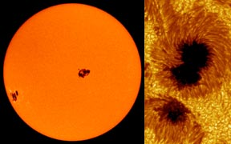
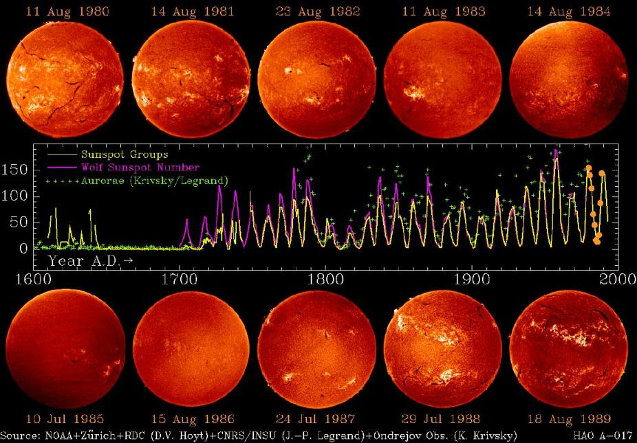

```{r, echo=FALSE}
htmltools::img(src = knitr::image_uri("QMlogo.png"), 
               alt = 'logo', 
               style = 'position:absolute; top:0; right:0; padding:10px; width:30%;')
```

```{r setup, include=FALSE}
knitr::opts_chunk$set(echo = TRUE)
```

## 1. Yearly Sunspot Data <a id="section-1"></a>

After installing Prophet, I used "data()" from the "datasets" package to
view the potential data sets I can use for this project. From this, I
have chosen the *"sunspot.year"* dataset which shows the yearly numbers
of sunspots between years 1700 and 1988 recorded by the World Data
Center. This data is updated when new counts become available therefore
I will use time series analysis to forecast data and see if there are any underlying trends or patterns.

<center></center>

Plotting the data, you can see clear fluctuations in the number of
sunspots between 1700 to 1988. There is no obvious trend however there
are recurring peaks which may suggest seasonality:

<center>

```{r, echo=TRUE}
plot(sunspot.year, main="Yearly Sunspot Data", ylab="Sunspots", col="#990000")
```

</center>

### 1.1 Creating a Data Frame

Now lets make a data frame using the sunspot data:

```{r, include=TRUE}
ssy<-data.frame(ds=zoo::as.yearmon(time(sunspot.year)), y=sunspot.year)
```

This code creates a data frame *"ssy"* with two columns:

-   **ds**: this column contains the time index which is converted into
    monthly and yearly intervals using the *"zoo"* package where the
    *"time()"* function extracts the time index from the
    *"sunspot.year"* data set. We use the *"zoo"* package to convert
    the sunspot data from a time series to a data frame.
-   **y**: this column contains the actual data corresponding to each
    time index in the *"sunspot.year"* data set.
    
### 1.2 Variable for Trend

```{r echo=TRUE, message=FALSE}
m<-prophet::prophet(ssy)
```

This line of code initializes the Prophet model to our data set which we
can then use to make forecasts of future sunspot activity. When running
this code, it came up with a message saying that weekly and daily
seasonality had been disabled. This is because prophet was unable to
find weekly or daily seasonality meaning these options for seasonality can be ruled out.

## 2. Forecast of the Sunspot Data <a id="section-2"></a>

```{r echo=TRUE}
future<-prophet::make_future_dataframe(m, periods=100, freq="year")
forecast <-predict(m,future)
```

Since our data is in months, I have made a variable *"future"* which uses
prophet to create a new data frame for 100 years into the future. The variable *"forecast"* predicts the future number of sunspots.

We can now create a plot of the forecasted data!

### 2.1 Trend And Forecast Plot

<center>

```{r echo=TRUE}
plot(m,forecast, xlab="Time", ylab="Sunspots", main="Sunspot Activity Forecast")
```

</center>
(the title of the plot doesn't show for some reason)

Here, we can see that the actual data deviates a lot from the trend line so maybe the data doesn't fit with our model that well? Nevertheless we can break the plot down into its components of year and seasonality.

### 2.2 Plot of Forecast Components

Since the graph above is difficult to analyse as a whole, we can produce plots of the forecast components:

<center>
```{r echo=TRUE}
prophet::prophet_plot_components(m, forecast)
```
</center>

## 3. Conclusion <a id="section-3"></a>

From the components plot, we can see that there is an underlying trend. Overall, there is a positive correlation between time and the number of sunspots on our sun. Seasonality-wise, there is no clear pattern- the number of sunspots varies each month. However, from the graph it suggests that we see the most sunspots at the start of the year and less at the end of the year. During most of the year, the number of sunspots stay relatively close to the average. Realistically, sunspot seasonality wont be seen within the span of one year. Maybe there is seasonality over a time index greater than a year? On [Wikipedia](https://en.wikipedia.org/wiki/Solar_cycle) it states that there is in fact a sunspot cycle which occurs every 11 years. Therefore next time, our data will have to be adjusted with added seasonality over an 11 year period instead of yearly or monthly.

<br>

<center>{width=60%}</center>

<br>
<br>
